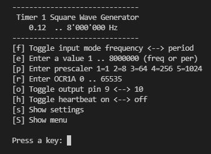

# Timer1Squarewavegenerator
Shows how to realize a wide range squarewave generator with Timer1.
## Features
- Range 0.12 Hz to 8 MHz
- Operation via CLI menu
- Input for frequency / period: 1 .. 8000000 [Hz / μs]
- Input for prescaler 1 .. 5 corresponding to 1, 8, 64, 256, 1024
- Input for output compare register (OCR1A) 0 .. 65535 (0xFFFF)
- Display of prescaler and OCR and computed values for frequency and period
- Output signal switchable between pin 9 and pin 10
- Turning on or off a heartbeat

The project shows how a simple square wave generator can be realized with the 
timer1 of the Arduino Uno. With the help of the prescaler and the 16-bit output 
control register the maximum possible frequency range of 0.12 Hz to 8 MHz should 
be adjustable. Because prescaler and register can only be changed in steps, not
arbitrary frequencies are possible. For lower frequencies finer steps are possible 
than for higher ones. For example, the next lower frequency after 8 MHz is already
4 MHz and down to 1 MHz only 6 intermediate values are possible.

If not exact frequencies are required for a test, this generator can be quite useful. 
Since prescaler and register can also be manipulated directly via the CLI menu on 
the serial monitor and the calculated values are displayed, this deepens the 
understanding of the interaction of prescaler and register. 

## User Interface
The user interface is a simple command line interface (CLI). The menu items are self-explanatory.


## Program Code
To realize the generator we have to set specific bits in the following registers:

- TCCR1A the Timer Counter Control Register A
- TCCR1B the Timer Counter Control Register B
- OCR1A the Output Compare Register A
- TIMSK1 the Timer Interrupt Mask Register

In register TCCR1A the output pin is set, in TCCR1B the timer mode and the prescaler, 
in register OCR1A the comparison value is written and TIMSK1 is set to 0, because no 
interrupt is to be generated.

And this is how it looks in the program code: 
```
  TCCR1A = 0;  // clear the register
  if (pin ==  9) TCCR1A = 1 << COM1A0;  // set output pin
  if (pin == 10) TCCR1A = 1 << COM1B0;
  TCCR1B = 0b00001001; // Prescaler = 001 = 1
  //             ^--- 
  //             | |
  //             | prescaler bits,
  //             WGM12 bit for CTC mode
  TIMSK1 = 0; // clear the register
```
But the most important thing is still missing. How must the bits of the prescaler and 
the value of the output compare register be set? For this we still need some 
definitions and formulas: 
```
  prescaler:       3 least significant bits of TCCR1B = 0b00000xxx
                   stand for a divider of 1, 8, 64, 256, 1024 for fo
  compare value:   OCR1A (output compare register) contains values 0x0000 .. 0xFFFF

  fo               8'000'000 (half of fcpu)
  f                desired frequency in Hz
  T                desired period in seconds
  Tus              desired period in microseconds
  ocr              content of 16-bit register OCR1A 

  f = fo / ((ocr + 1) * pre),  fo = 8'000'000 Hz and pre = 1, 8, 64, 256, 1024
  T = (ocr+1) * pre / fo

  ocr = fo / f / pre - 1
  ocr = T * fo / pre - 1  
      = Tus * 8 / pre - 1

  If the value of ocr is greater than 0xFFFF, the next higher prescaler is taken

  The tables below show the resulting frequencies and periods for the possible 
  prescalers and the ocr values 0x0000 and 0xFFFF. 

                                 Resulting frequencies [Hz]
                -------------------------------------------------------------- 
  pre =         1            8            64           256          1024
                --------------------------------------------------------------
  ocr = 0x0000  8000000      1000000      125000       31250        7812.5
  ocr = 0xFFFF  122.0703125  15.25878906  1.907348633  0.476837158  0.11920929

                                 Resulting periods [us]
                --------------------------------------------------------------            
  pre =         1            8            64           256          1024
                --------------------------------------------------------------
  ocr = 0x0000  0.125        1            8            32           128
  ocr = 0xFFFF  8192         65536        524288       2097152      8388608  
```
With this knowledge we can now calculate the value for the 16-bit register OCR1A. 
To get the best accuracy, we convert the 32-bit integers of fo, freq and pre to 
floating point numbers, round the result and convert back to a 16-bit integer 
for the ocr value.
```
  OCR1A = (uint16_t)(round( (double)fo / (double)pre / (double)freq - 1.0 ));
```
